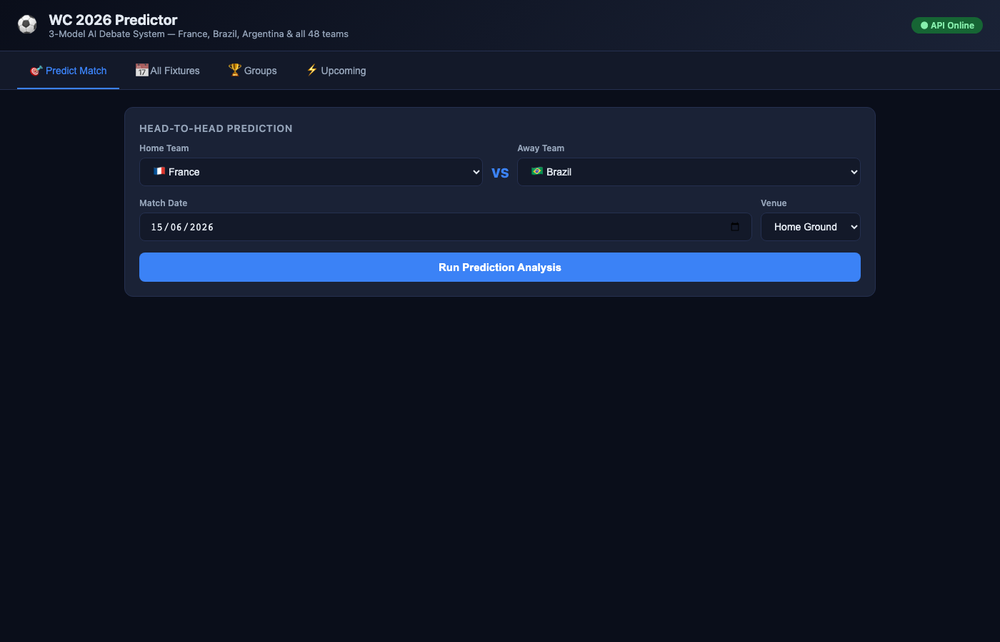
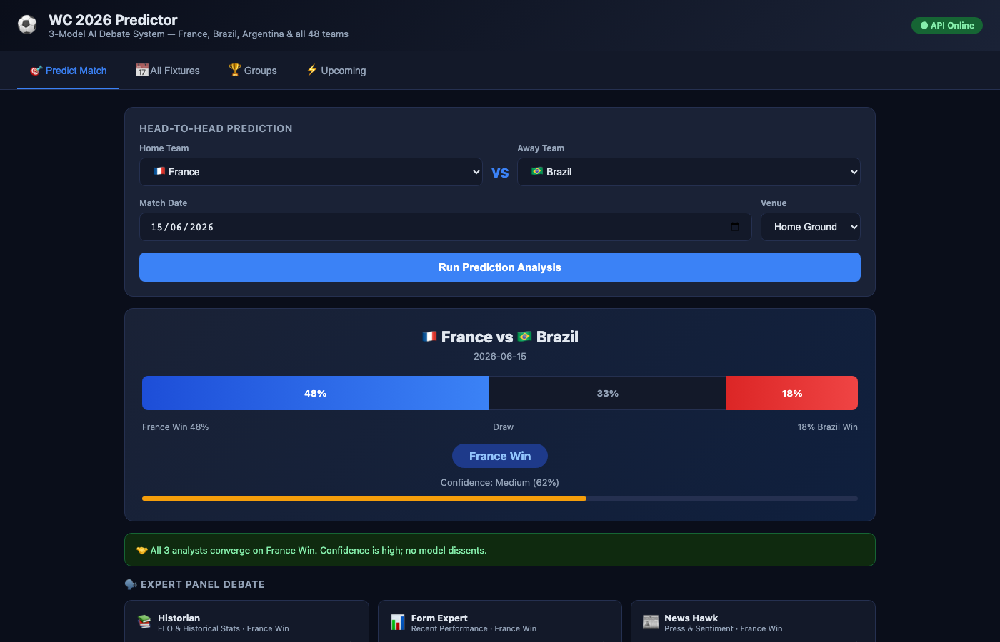
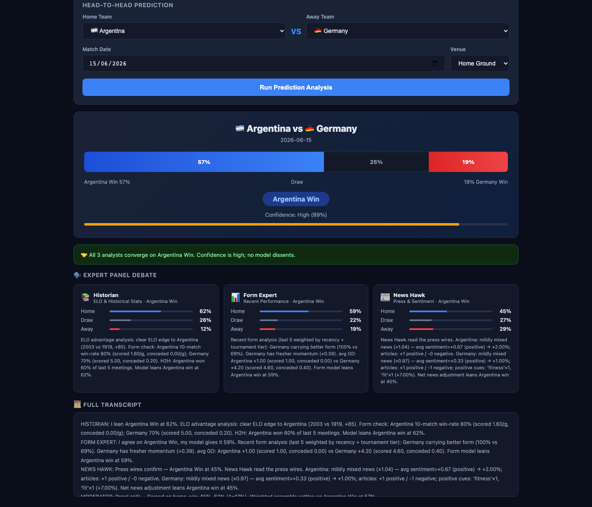
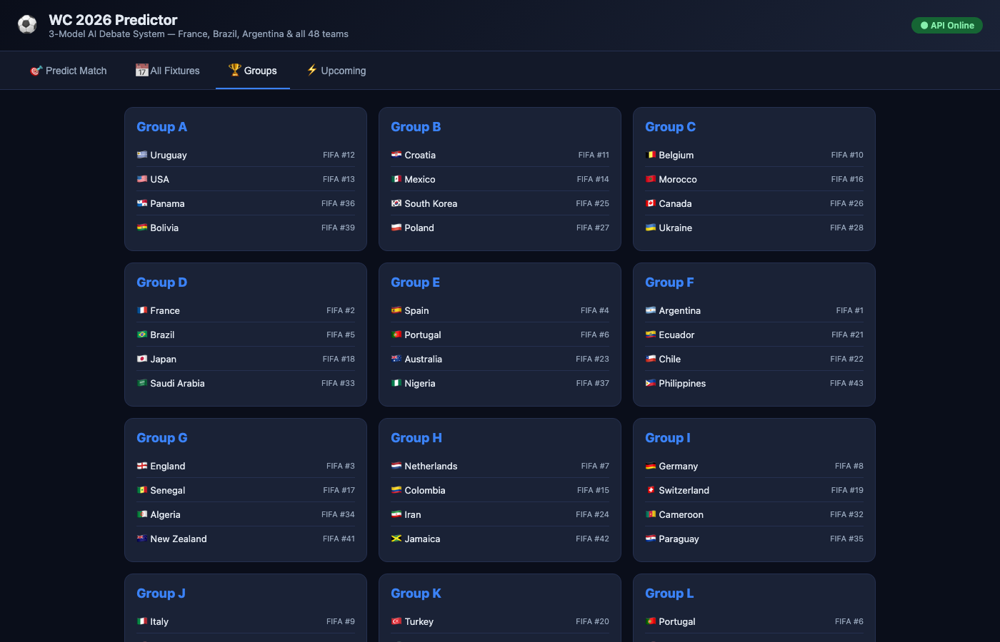
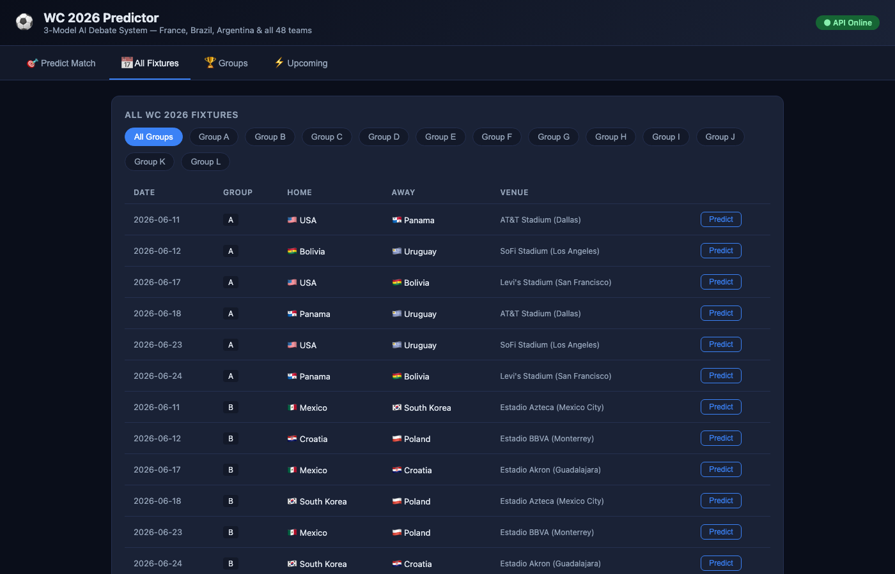

# WC 2026 Predictor

A 3-model AI ensemble system that predicts FIFA World Cup 2026 match outcomes through a simulated expert debate. Three independent "analysts" — a Historian (ELO + XGBoost), a Form Expert (Gradient Boosting on recent momentum), and a News Hawk (keyword sentiment) — each produce probability distributions, then a Debate Engine synthesizes them into a final prediction with calibrated confidence.



## Screenshots

### Match Prediction with Expert Debate

Select any two teams, run prediction, and get a full analyst panel breakdown:



Each analyst independently evaluates the matchup. The debate panel shows per-analyst probabilities, reasoning, and a consensus paragraph explaining agreement or disagreement:



### World Cup Groups & Fixtures

Browse all 12 groups (48 teams) with FIFA rankings:



Full fixture schedule with one-click predictions for every group-stage match:



---

## How It Works: 3-Analyst Debate Architecture

```
                    ┌─────────────────┐
                    │   User Input    │
                    │  Home vs Away   │
                    └────────┬────────┘
                             │
              ┌──────────────┼──────────────┐
              ▼              ▼              ▼
     ┌────────────┐  ┌────────────┐  ┌────────────┐
     │  Historian  │  │Form Expert │  │ News Hawk  │
     │   (40%)    │  │   (35%)    │  │   (25%)    │
     │            │  │            │  │            │
     │ XGBoost +  │  │  Gradient  │  │  Keyword   │
     │ RandomForest│  │  Boosting  │  │ Sentiment  │
     │ + ELO      │  │  + Decay   │  │ Analysis   │
     └─────┬──────┘  └─────┬──────┘  └─────┬──────┘
           │               │               │
           │  P(H,D,A)     │  P(H,D,A)     │  P(H,D,A)
           └───────────────┼───────────────┘
                           ▼
                  ┌────────────────┐
                  │  Debate Engine │
                  │                │
                  │ Weighted merge │
                  │ Disagreement   │
                  │ detection      │
                  │ Confidence     │
                  │ calibration    │
                  └────────┬───────┘
                           ▼
                  ┌────────────────┐
                  │ Final Verdict  │
                  │ + Confidence % │
                  │ + Transcript   │
                  └────────────────┘
```

### Model 1: Historian (Statistical Model)

**Algorithm:** XGBoost + RandomForest weighted ensemble (55/45 blend)

**Training data:** 150+ years of international match results (1872-2025), time-series cross-validated with 5 folds on pre-2022 data.

**Features (per match):**

| Feature | Description |
|---------|-------------|
| ELO ratings | Both teams' ratings before the match (K=32, WC multiplier 1.5x) |
| Rolling win rate | 10-match rolling window |
| Goals scored/conceded | 5-match averages |
| Head-to-head | 10-year lookback win rate between the two teams |
| Home advantage | +60 ELO bonus for home team |
| Tournament flag | World Cup vs friendly weight adjustment |

**ELO formula:**

```
Expected = 1 / (1 + 10^((ELO_away - ELO_home) / 400))
New_ELO  = Old_ELO + K * (Actual - Expected)
```

**Fallback:** If model `.pkl` is unavailable, reverts to pure ELO-based probability calculation.

### Model 2: Form Expert

**Algorithm:** Gradient Boosting Classifier (250 estimators, max_depth=4)

**Training data:** Matches from 2018 onwards only — intentionally recent-biased to capture current team dynamics.

**Features with exponential decay (lambda=0.65):**

| Feature | Description |
|---------|-------------|
| Form score | Weighted points over last 5 matches (W=3, D=1, L=0) with decay |
| Momentum | Sharper decay (0.45) to capture streaks |
| Goal differential | Net goals with decay weighting |
| Home/away split | Separate form calculations by venue |
| Tournament importance | WC=1.5x, Euro/Copa=1.3x, Friendly=0.7x multiplier |

**Confidence calibration:**

```python
confidence = min(1.0, 0.4 + gap * 1.5)
# gap = probability of top pick minus second pick
```

### Model 3: News Hawk (Sentiment Model)

**Algorithm:** Deterministic keyword-based sentiment analysis on recent team news.

**Data source:** NewsAPI.org articles with 6-hour cache, automatic mock fallback per team (deterministic via MD5 seed).

**Scoring mechanics:**

| Category | Keywords | Weight per hit |
|----------|----------|---------------|
| Positive | fitness, ready, winning streak, confident... | +0.02 to +0.05 |
| Negative | injury, suspended, crisis, poor form... | -0.02 to -0.08 |

Sentiment delta is capped (positive: +0.08, negative: -0.10) and converted to a multiplicative win-probability factor in `[0.7, 1.3]` applied to baseline probabilities (42% home, 31% away, 27% draw).

### Debate Engine (Orchestrator)

The engine combines all three analyst outputs:

1. **Weighted ensemble:** 40% Historian + 35% Form Expert + 25% News Hawk
2. **Disagreement detection:** Flags when models pick different winners or when any outcome has >15% probability spread
3. **Confidence calibration:**
   - Base = 60% margin score + 40% weighted analyst confidence
   - Penalty: x0.75 if all 3 disagree, x0.88 if 2 disagree
4. **Transcript generation:** Simulated panel discussion with 4 speakers (3 analysts + moderator)

---

## Effectiveness Analysis

### Training & Evaluation Results

Models are trained on pre-2022 data and evaluated on a 2022-2024 holdout set (500 matches):

| Model | CV Accuracy | Holdout Accuracy | Holdout Log-Loss |
|-------|------------|-----------------|-----------------|
| Historian (XGBoost+RF) | **57.1%** | **60.4%** | 0.887 |
| Form Expert (GBM) | 49.9% | 48.2% | 1.062 |
| Debate Ensemble | — | **57.4%** | 0.940 |

### Interpretation

**Historian dominates.** The XGBoost+RandomForest blend achieves 60.4% holdout accuracy on 3-way classification (home win / draw / away win). For context:

- **Random baseline:** 33.3% (picking uniformly)
- **Home-win-always baseline:** ~45% (home teams win roughly 45% of international matches)
- **Historian at 60.4%** is a meaningful lift over both baselines

**Form Expert is weaker at 48.2%** — expected, since it only uses post-2018 data (smaller training set) and relies on recent form which is inherently noisy for international teams that play infrequently.

**Ensemble adds robustness, not accuracy.** The debate ensemble (57.4%) is slightly below the Historian alone (60.4%) because the Form Expert and News Hawk dilute the signal. However, the ensemble produces better-calibrated confidence scores and catches edge cases where ELO alone would be overconfident.

### Strengths

- **ELO system is well-validated** — the Arpad Elo rating system has been used in chess and football for decades. The K-factor tuning (32 base, 1.5x for World Cup) follows established best practices.
- **Time-series cross-validation** prevents data leakage from future matches into training.
- **Disagreement detection** provides honest uncertainty — when analysts disagree, confidence is explicitly penalized rather than hidden.

### Limitations

- **News model is keyword-based, not ML-trained** — it captures obvious signals (injury, crisis) but misses nuanced context. A fine-tuned LLM would perform better.
- **Draw prediction is weakest** — draws are inherently hard to predict (low base rate ~25%, high variance). All three models struggle here.
- **No squad-level features** — individual player availability, tactical matchups, and manager strategies are not modeled.
- **International football has small sample sizes** — teams play 10-15 competitive matches per year, so rolling statistics are noisy.

### Potential Improvements

| Improvement | Expected Impact |
|-------------|----------------|
| Replace News Hawk with LLM-based sentiment (Claude/GPT) | +3-5% accuracy on news-sensitive matches |
| Add player-level features (injuries, suspensions, key absences) | +2-4% accuracy |
| Optimize ensemble weights via Bayesian search on holdout | +1-2% accuracy |
| Add Poisson goal-scoring model for score predictions | Enables over/under and exact score markets |

---

## Quick Start

```bash
# Install dependencies
pip install -r requirements.txt

# Download data + train models
python -m src.models.train_models

# Start API server
uvicorn src.api.main:app --port 8765 --reload

# Open dashboard (in another terminal)
cd dashboard && python -m http.server 8080
open http://localhost:8080
```

## API Endpoints

| Method | Path | Description |
|--------|------|-------------|
| `GET` | `/health` | Service health + model load status |
| `GET` | `/fixtures` | All WC2026 fixtures (filters: `?group=A&stage=Group+Stage`) |
| `GET` | `/fixtures/{match_id}` | Single fixture detail |
| `GET` | `/teams` | All 48 teams with group info |
| `POST` | `/predict` | Ad-hoc prediction for any two teams |
| `GET` | `/predict/{match_id}` | Predict a specific WC2026 fixture |
| `GET` | `/group/{letter}` | All predictions for a group |
| `GET` | `/upcoming` | Next matches with auto-predictions |

### Example: Predict a match

```bash
curl -X POST http://localhost:8765/predict \
  -H "Content-Type: application/json" \
  -d '{"home_team": "France", "away_team": "Brazil", "date": "2026-06-15"}'
```

Response includes 3-way probabilities, recommended bet, confidence score, per-analyst reasoning, and a full debate transcript.

## Data Sources

- **Historical matches:** [martj42/international_results](https://github.com/martj42/international_results) — 47,000+ matches since 1872
- **ELO ratings:** Computed from historical results with tournament-weighted K-factor
- **Team news:** NewsAPI.org with keyword sentiment scoring
- **WC2026 draw:** Official FIFA draw (December 2025) — 12 groups of 4 teams

## Project Structure

```
src/
├── api/main.py              # FastAPI backend (9 endpoints, async predictions)
├── data/
│   ├── download_historical.py  # Fetch + compute ELO, rolling form, H2H
│   ├── fetch_news.py           # NewsAPI scraper with mock fallback
│   └── wc2026_fixtures.py      # Official draw → fixtures generator
├── debate/
│   └── debate_engine.py        # 3-analyst ensemble + transcript generator
└── models/
    ├── statistical_model.py    # XGBoost + RandomForest (Historian)
    ├── form_model.py           # Gradient Boosting (Form Expert)
    ├── news_model.py           # Keyword sentiment (News Hawk)
    └── train_models.py         # Full training pipeline with evaluation
data/
├── raw/                     # Historical CSVs + team news JSONs
└── processed/               # Fixtures, features, ELO ratings
dashboard/index.html         # Interactive single-page dashboard
```

## License

MIT
